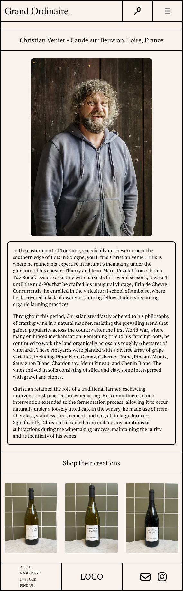

# Project Title

<details>

<summary>Overview</summary>
## Overview

What is your app? Brief description in a couple of sentences.

My app will be a brand website to help a local wine importer to shine. Hopefully having his own website that showcases the products that he imports and the producers he works with. I want to include a find Us page that gives the user a list of restaurant were the importer's products are available. Hopefully my app will help him make more sale and in the futur I would like to create an inventory app for importers too! (This is for another time)

</details>

<details>
<summary>Problem</summary>
### Problem

Why is your app needed? Background information around any pain points or other reasons.

I personnaly think that in the world we live in, in 2024 and in a really dynamic and fast-paced city like Montreal, if you have a brand or side business and you don't have a good branding like an instagram page, functional website, your logo, to name a few, to highlight your products, it's really hard to grow and not be outshined by other similar businesses.

I think their will always be a need for a e-commerce plateform, especially user friendly one that are afforfable and if I can recreate even 10-15% of that for my capstone I would be really pleased. My goal is to keep working on it way after the bootcamp to make it way more complex.

</details>

<details>
<summary>User Profile</summary>
### User Profile

The users would use this website to read about my friend's imported wines, learn about wine production and be able to discover the great humans behind the wine bottle they shop for.

</details>
<details>
<summary>Features</summary>
### Features

-The Home Page displays 6 bottles in the new arrivals section no matter how many bottles are in the database. I did it using a splice method to only display the first 6 available. Later on, this will also be sort by dates of newest wines. For the moment they all have the same date of creation. On top of it, I added a carousel that scroll these bottles horizontally on mobile view.

-See what just came in on the main page, when the user hovers over the bottle it lets them see the name of the wine with a fun color transition.

-The user will be able to read about wine producers and their creations carried by the importers.

-There's a live map that displays where Grand Ordinaire wines can be found in Montreal and its surroundings. This map is found in the Find us page. The map view is only available on tablet view and up. For mobile you can click on the address and it will redirect you to google maps' website with the right restaurant address and informations for navigation.

- Read about the company's mission and who's the team behind.

- You can find a downloadable PDF of the Grand Ordinaire's available products on the listing page.

</details>
<details>
<summary>Instructions</summary>
### Instructions

1A.You can visit my repository live on this website : "https://develop--dynamic-crepe-c3c437.netlify.app/"

1B. You must download a zip file from main, open it in VScode and npm i or npm install all dependencies.

2. I use three environment variables, two of which are not ment to be shared publicly. If you were to install my app on your own VSCODE, you should know that the google map part won't be functional since I won't be sharing my api key of course! But if you were to have an existing account with google maps api you can create a new map to have the map style code.
   REACT_APP_GOOGLE_MAPS_KEY=Your_Own_KEY
   REACT_APP_GOOGLE_MAPS_STYLE=Your_Own_Map_Style
   REACT_APP_BASE_URL=http://localhost:8080/

   -The third environement variable is used if you intend to run my back end on your computer as well. You can find my back end repository here : "https://github.com/veronique1415/GO-Backend".

3.Run npm start in the your terminal.

</details>
<details>
<summary>Implementation</summary>
## Implementation

<details>
<summary>Tech Stack</summary>
### Tech Stack

Here's a list of tech I used to make this app:

-React
-React-router-dom
-Axios
-MySQL
-Sass
-Express

</details>
<details>
<summary>APIs</summary>
### APIs

I used google Maps embeded map to show users where they can find the importer's bottle of wine in Montreal. Each marker will show a restaurant or store's name and address.

I use my own API as well. You can find my back-end repository here : "https://github.com/veronique1415/GO-Backend"

</details>
<details>
<summary>Sitemap</summary>
### Sitemap

- The HomePage showcases new arrivals and a hero picture.

- About section that gives you a description of their mission with this company + a brief presentation of the team behind it.

- Find us section that show the user where their products can be found in Quebec

- Producers section that give a description of who's being the production of every single bottle of wine and where they are from and which wine does the importer carry from them at the moment.

- Products section ordered by wine type (color probably) with a description from each bottle.

- A listing section that will show a uploaded PDF with up to date stock that restaurant or an individual that would like to order for their own cellar.

</details>
<details>
<summary>Mockups</summary>
### Mockups

I have make a mockup of my Home and About sections.


</details>

<details>
<summary>Screenshots</summary>
### Screenshots

Here you can find screen shot of what the website looks like when launched as prototype 1 :





Note that I only included screenshots of mobile view

</details>
<details>
<summary>Data</summary>
### Data

I store my data in a database. This is what I really wanted to play with for this Capstone, I wanted to get comfortable with it.
I have 1 database with 2 tables.

1. Producers {
   producer_id
   producer_name
   producer_region
   producer_village
   producer_description
   producer_image
   wine_id (foreign key)
   }

2. Wines {
   wine_id
   wine_name
   wine_region
   wine_appelation
   wine_description
   wine_image
   wine_varietal
   wine_producer
   wine_vinatge
   }


</details>
<details>
<summary>Endpoints</summary>
### Endpoints

<!-- "use client";

import { useState } from "react";
import {
APIProvider,
Map,
AdvancedMarker,
Pin,
InfoWindow,
} from "@vis.gl/react-google-maps";
import "./Map.scss"

const MapComp = () => {
const position = { lat: 45.508888, lng: -73.561668 };
const vinMonLapin = { lat: 45.53300094604492, lng: -73.61061096191406};
const [open, setOpen] = useState(false); -->

  <!-- return (
    <article className="map__container">
      <APIProvider apiKey={process.env.REACT_APP_GOOGLE_MAPS_KEY}>
        <div className="map">
          <Map zoom={13} center={position} mapId={process.env.REACT_APP_GOOGLE_MAPS_STYLE}>
            <AdvancedMarker position={vinMonLapin} onClick={() => setOpen(true)}>
              <Pin />
            </AdvancedMarker>

            {open && (
              <InfoWindow position={vinMonLapin} onCloseClick={() => setOpen(false)}>
                <p>Vin Mon Lapin</p>
             </InfoWindow>
            )}
          </Map>
        </div>
      </APIProvider>
    </article>  
  );
} -->

This is how I fetch GoogleMaps into my app. It takes a API key and a map style number. I already tested it and it works.

**GET /producers**

Get a list of all producers to display on the ProducerPage
Response:


**GET /producers/:producerId**

Response:


**GET /products**

- Render every available bottle of wine on the /wines page

Response:


**GET /products/:productId**

Response:


</details>

<details>
<summary>Roadmap</summary>
## Roadmap

Scope your project as a sprint. Break down the tasks that will need to be completed and map out timeframes for implementation. Think about what you can reasonably complete before the due date. The more detail you provide, the easier it will be to build.

1. Create a mock up of every pages to let me identify every component and see if I can easily repeat them on mulitple pages. This
2. Do the styling of my website (I like starting with what I'm really comfortable with) I probablye can have this done in a week.
3. Do the routes of my app (couple hours for sure)
4. Add functionality - hovering effect, map markers. (couple hours I think, one or two evenings)
5. backend functionnality - this will probably be my biggest chunk.

</details>
<details>
<summary>Lessons learned</summary>
## Lessons learned

Where to start?

Building a web app that's all your can mean that you might tend to turn some corners you wouldn't if having an actual style guide and data science based research. I think this app showcases really well my abilities but I think that for now it is no where near semantically perfect visually. I am no designer and I didn't interview anyone before building this website so you can tell it is solely based on my own taste.

When making a carousel of my own while using libraries like bootstrap, you can rapidely fall into this pitt of css being overwritten by the said library. I basically add to make a new section that only displays itself on mobile and displays none when on tablet to keep using bootstrap for the rest of my layout. This one was a bit more challenging and made me a bit worried about the semantics again. I think this is all a big learning experience and I would probably do the whole section over without bootstrap if I had more time and energy.

I'm gonna be honest, the rest was pretty seamless. I found myself having a lot of fun creating my own project, revisting my old projects here and there to add functionalities I've used in the past. I can't wait to build a completely new app or make this one better soon.

</details>
<details>
<summary>Nice-to-haves</summary>
## Nice-to-haves

I would like to add a search bar that let you search your product by name or producer

I wanna add authentification to add an upload page for the admin.

In the future I would like to implement an ordering function directly from the website. Ordering wine in Quebec, beside directly from our liquor monopole is really complicated and I would like to make my friend's life easier by having his users be able to order directly from the website and pay. He would then receive a order confirmation and only have to arrange the shipping from SAQ then. Obviously from their end, the user would also receive a order confirmation from the email they provided.

I say in the futur because I wanna try to be realistic with what I think I can produce with the amount of time we will have after approval until our presentation day. It does drive me to think about what will be implementable afterward to greatlyt update his website's feature and showcase even more what I'm capable of.

</details>
</details>
```
